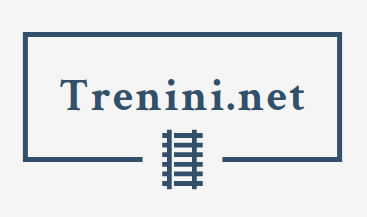

# Trenini.Net


[](https://coveralls.io/github/CarloMicieli/TreniniDotNet?branch=master)



An application to manage model railway collections.

## Setup

### Requirements

- `.NET Core 3.1.4`
- `Postgres SQL 12`

### Setup

#### Postgres

Add the PostgreSQL 12 repository

```
$ wget --quiet -O - https://www.postgresql.org/media/keys/ACCC4CF8.asc | sudo apt-key add -
$ echo "deb http://apt.postgresql.org/pub/repos/apt/ `lsb_release -cs`-pgdg main" |sudo tee  /etc/apt/sources.list.d/pgdg.list
```

Install both server and client:

```
$ sudo apt update
$ sudo apt -y install postgresql-12 postgresql-client-12
```

### Database init

Create a new database (development *only*):

```
postgres=# CREATE DATABASE TreniniDb;
CREATE DATABASE
postgres=# CREATE USER tdbuser WITH ENCRYPTED PASSWORD 'tdbpass';
CREATE ROLE
postgres=# ALTER USER tdbuser CREATEDB;
GRANT
```

## Run the application

### Web application

```
$ dotnet run --project Src/Web
[18:57:52 INF] Now listening on: http://localhost:5000
[18:57:52 INF] Now listening on: https://localhost:5001
[18:57:52 INF] Application started. Press Ctrl+C to shut down.
[18:57:52 INF] Hosting environment: Production
[18:57:52 INF] Content root path: /home/carlo/Projects/TreniniDotNet/Src/Web
```

The Swagger documentation page is at [https://localhost:5001/swagger](https://localhost:5001/swagger).

### Grpc services & data seeding

The application provides Grpc services

```
$ dotnet run --project Src/GrpcServices
[20:34:40 INF] Now listening on: https://[::]:6001
[20:34:40 INF] Now listening on: http://[::]:6000
[20:34:40 INF] Application started. Press Ctrl+C to shut down.
[20:34:40 INF] Hosting environment: Development
[20:34:40 INF] Content root path: /home/carlo/Projects/TreniniDotNet/Src/GrpcServices
```

Grpc services are listening on the port `6001`.

With the Grpc services running, it is possible to run the data seeding tool:

```
$ cd Tools/DataSeeding
$ dotnet run
DataSeeding 1.0.0
Copyright (C) 2020 DataSeeding

ERROR(S):
  No verb selected.

  brands          Send brands

  catalogItems    Send catalog items

  railways        Send railways

  scales          Send scales

  help            Display more information on a specific command.

  version         Display version information.
```

To send all brands present in the `brands.yaml`, run:

```
$ dotnet run -- brands -u https://localhost:6001 -i Resources/brands.yaml
$ dotnet run -- railways -u https://localhost:6001 -i Resources/railways.yaml
$ dotnet run -- scales -u https://localhost:6001 -i Resources/scales.yaml
```

## Running the tests

This command will run all tests (unit tests and integration tests):

```
$ dotnet test
```

## Use cases

### Catalog

#### Brands

A **Brand** represents a model railways rolling stock manufacturer.

```csharp
interface Brand
{
    BrandId BrandId { get; }
    Slug Slug { get; }
    string Name { get; }
    Uri? WebsiteUrl { get; }
    MailAddress? EmailAddress { get; }
    string? CompanyName { get; }
    string? GroupName { get; }
    string? Description { get; }
    BrandKind Kind { get; }
    Address? Address { get; }
}
```

* Create/modify **brands**;
* Find a **brand**, by its SEO friendly ("slug") identifier
* Find all **brands**, with paginated results

#### Railways

A **Railway** represents a operator of the rail transport.

```csharp
interface IRailway
{
    RailwayId RailwayId { get; }
    Slug Slug { get; }
    string Name { get; }
    Country Country { get; }
    string? CompanyName { get; }
    PeriodOfActivity PeriodOfActivity { get; }
    RailwayGauge? TrackGauge { get; }
    RailwayLength? TotalLength { get; }
    Uri? WebsiteUrl { get; }
    string? Headquarters { get; }
}
```

* Create/modify **railways**;
* Find a **railway**, by its SEO friendly ("slug") identifier;
* Find all **railways**, with paginated results.

#### Scales

A **Scale** represents a __scale__ of model railway.

```csharp
interface IScale
{
    ScaleId ScaleId { get; }
    Slug Slug { get; }
    string Name { get; }
    Ratio Ratio { get; }
    ScaleGauge Gauge { get; }
    string? Description { get; }
    int? Weight { get; }
    IImmutableSet<ScaleStandard> Standards { get; }
}
```

* Create/modify **scales**;
* Find all **scales**, with paginated results;
* Find a **scale**, with its SEO friendly ("slug") identifier.

#### Catalog items

* Create/modify **catalog items**, with one or more **rolling stock** included;
* Find a **catalog item**, with its SEO friendly ("slug") identifier.

### Collecting

#### Collections

* Create a new **collection**, collections are always private and each user can have only one collection;
* Get the user **collection**, only the owner can see his collection;
* Add a new catalog item to a **collection**;
* Edit a catalog item in the **collection**;
* Get collection statistics: items count and value by category.

#### Wishlists

* Create a new **wish list**, wish lists have a visibility (either __public__ or __private__). A user can create one or more wish lists;
* List all **wish lists** by user;
* Add a new catalog item to a **wish list**;
* Edit a catalog item in the **with list**;
* Delete a **with list**.

#### Shops

* Create a new **shop**;
* Add/remove shop from the user favourites.

## Project layout

* `Common` contains the interfaces and utilities classes that don't have a clear place in other projects.
* `Domain` contains the domain model, with all factories required to create new values. Domain objects are immutable.
* `Application` contains the application services, and the **use cases** implementation. At this layer, we abstract the database access and depend on this abstraction. Business logic is cleanly separated from infrastructure details.
* `Infrastructure` is the place where **use cases** are getting their persistence requirement satisfied. The database access is using plain old sql and dapper.
* `Web` is the top layer - use cases are orchestrated using the IMediatr library and everything is wired together via the built-in dependency injection.
* `GrpcServices` another way to consume the use cases, via Grpc services. It currently implements only services to create new values.

Tests project are in the `Tests` directory.

* `TestHelpers` has the main goal to provide test data. It is getting boring to make the same values for tests over and over again.
* `Common.UnitTests` contains unit tests for the `Common` project.
* `Domain.UnitTests` contains unit tests for the `Domain` project. The more relevant tests here are the ones validating domain object constraints and factories.
* `Application.UnitTests` contains unit tests for the `Application` project. Here we are testing the use cases, running the real use case handlers and services - only persistence is running against an in-memory implementation (just plain .NET collections).
* `Infrastructure.UnitTests` contains unit tests to ensure repositories (and mostly hand-written sql queries) are working properly. The tests are running against an in memory instance of Sqlite, using some helper classes to make the testing more nice and clean. 

```csharp
[Fact]
public async Task BrandsRepository_Add_ShouldInsertNewBrands()
{
    Database.Setup.TruncateTable(Tables.Brands);

    var testBrand = new TestBrand();
    var brandId = await Repository.AddAsync(testBrand);

    brandId.Should().Be(testBrand.BrandId);

    Database.Assert.RowInTable(Tables.Brands)
        .WithPrimaryKey(new
        {
            brand_id = testBrand.BrandId.ToGuid()
        })
        .WithValues(new
        {
            slug = testBrand.Slug.ToString(),
            name = testBrand.Name,
            version = testBrand.Version,
        })
        .ShouldExists();
}

[Fact]
public async Task BrandsRepository_GetBySlug_ShouldFindOneBrandBySlug()
{
    Database.Setup.TruncateTable(Tables.Brands);

    Database.Arrange.InsertOne(Tables.Brands, new
    {
        brand_id = Guid.NewGuid(),
        name = "A.C.M.E.",
        slug = "acme",
        company_name = "Associazione Costruzioni Modellistiche Esatte",
        kind = BrandKind.Industrial.ToString(),
        version = 1,
        created = DateTime.UtcNow
    });

    var brand = await Repository.GetBySlugAsync(Slug.Of("acme"));

    brand.Should().NotBeNull();
    brand.Slug.Should().Be(Slug.Of("acme"));
}
```

* `Web.UnitTests` - this project contains unit tests on the view model preparation.

* `Web.IntegrationTests` - this project contains integration tests, here the application runs inside a fake web container - the persistence code is running against a "real" database (SQLite - with a database file stored on disk). The integration tests have the main goal to validate web apis.

## Built With

* [.NET Core 3.1](http://dot.net) - Back end
* [Angular](https://www.angular.io/) - Front end 

## Contributing

Please read [CONTRIBUTING.md](CONTRIBUTING.md) for details on our code of conduct, and the process for submitting pull requests to us.

## Versioning

We use [SemVer](http://semver.org/) for versioning. For the versions available, see the [tags on this repository](https://github.com/CarloMicieli/TreniniDotNet/tags). 

## Authors

* **Carlo Micieli** - *Initial work* - [CarloMicieli](https://github.com/CarloMicieli)

See also the list of [contributors](https://github.com/CarloMicieli/TreniniDotNet/contributors) who participated in this project.

## License

This project is licensed under the MIT License - see the [LICENSE.md](LICENSE.md) file for details

## Acknowledgments

* Robert C. Martin. 2017. Clean Architecture: A Craftsman�s Guide to Software Structure and Design (1st. ed.). Prentice Hall Press, USA.
* Ivan Paulovich - [Clean Architecture with .NET Core](https://github.com/ivanpaulovich/clean-architecture-manga)
* Jimmy Bogard's talks

